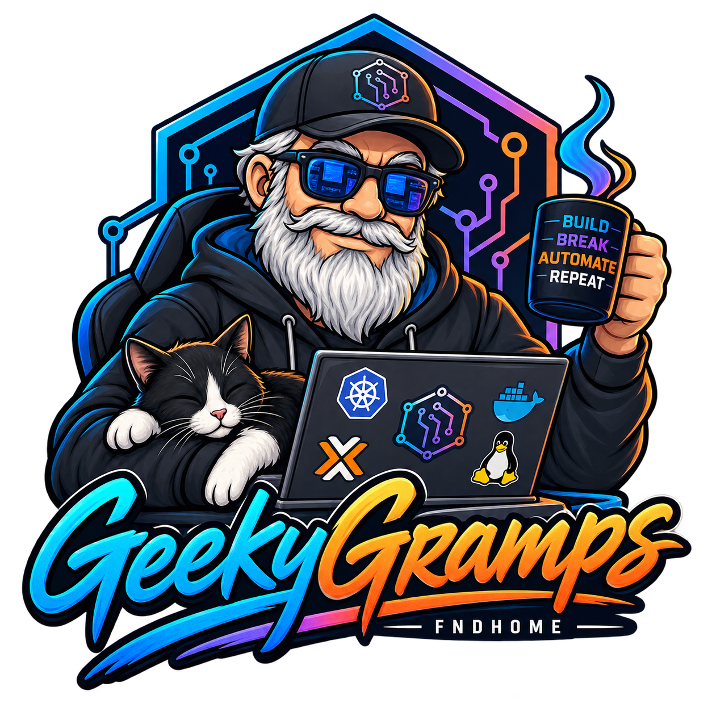
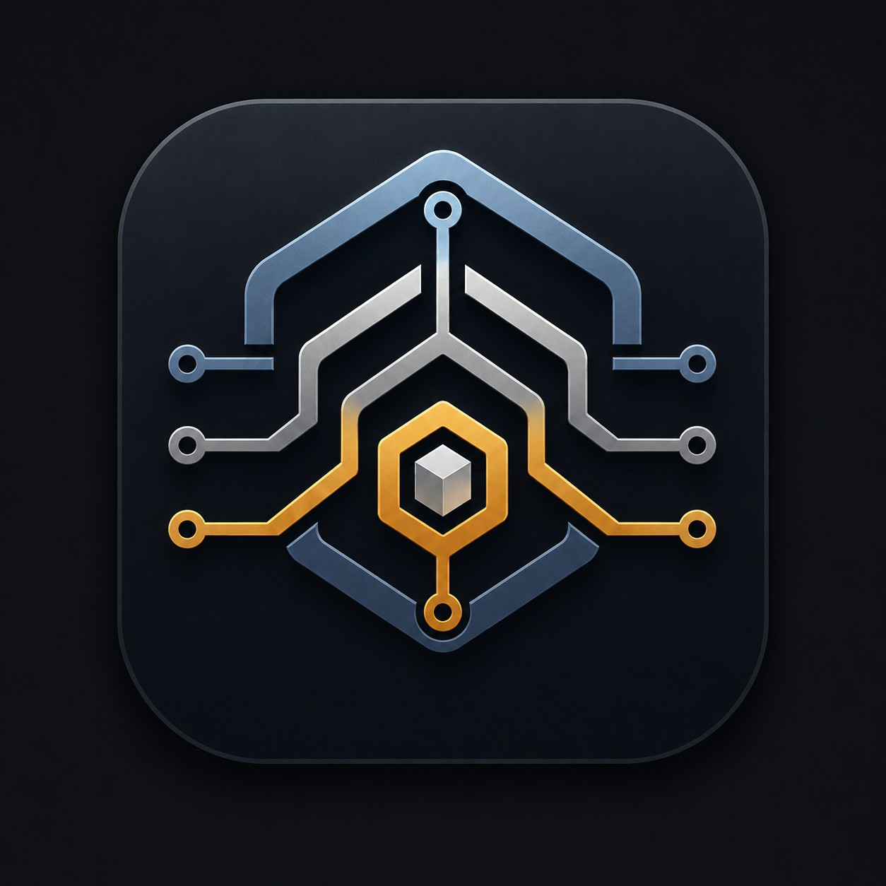
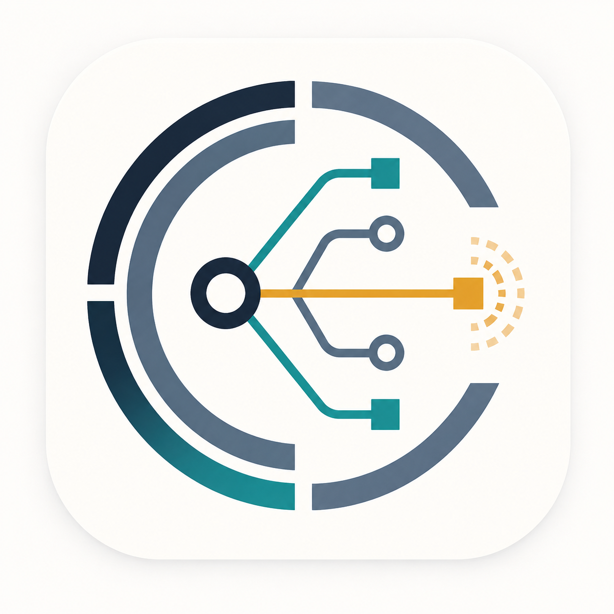
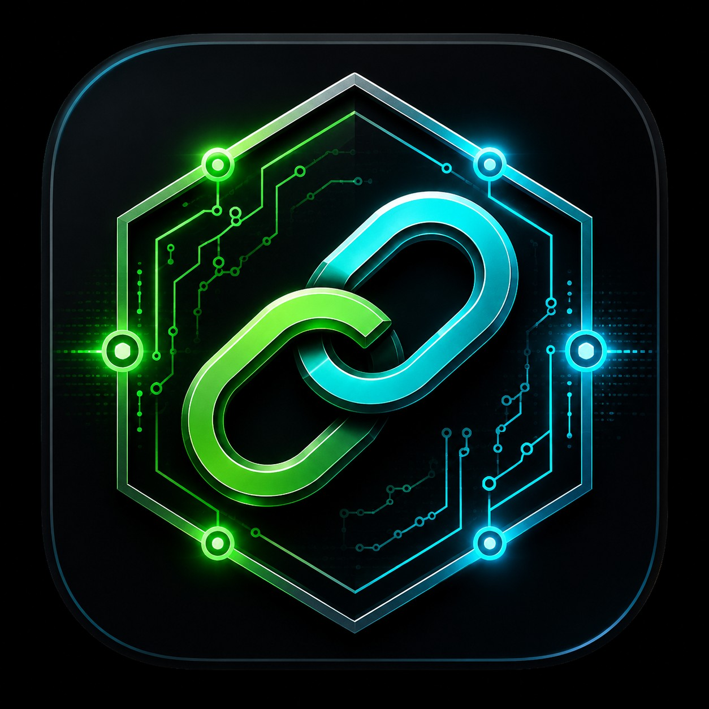
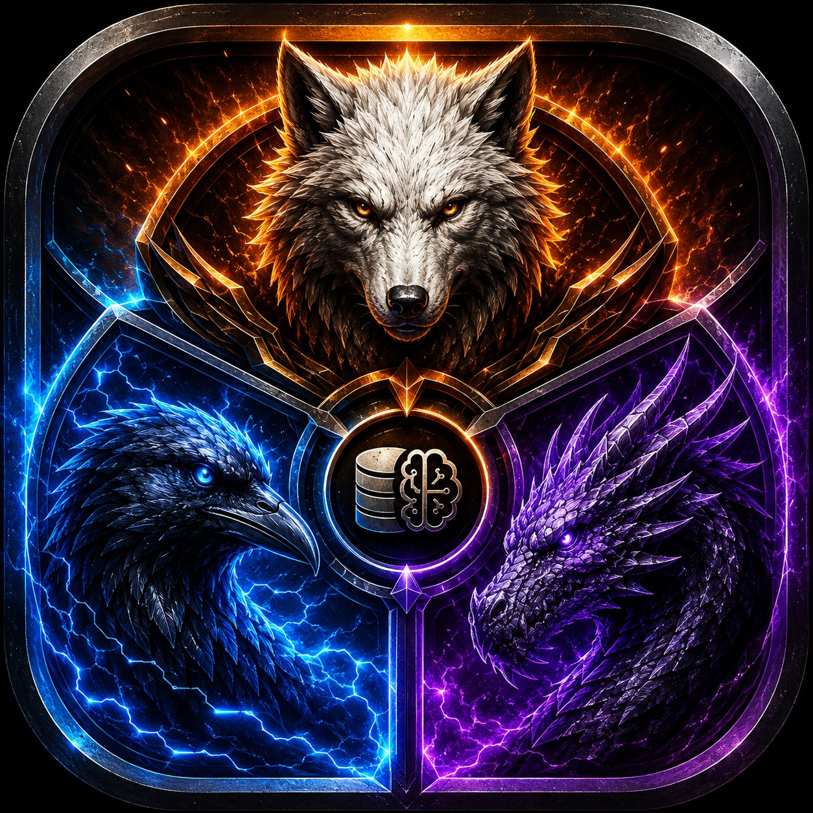
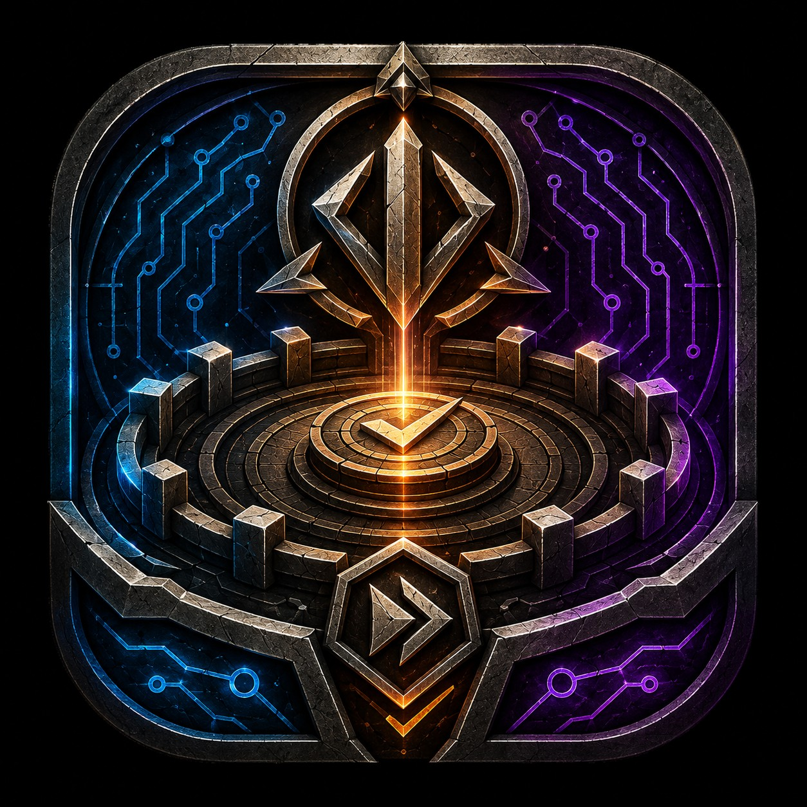

Homelab infrastructure and AI-agent tooling — Kubernetes (k3s), Ceph, multi-agent orchestration (Claude/Codex/Antigravity), and the automation that ties them together. Everything below is published for portfolio purposes: real design, real agent/workflow code, with live-infrastructure detail (credentials, internal hostnames, IPs) kept private.

---

<table>
<tr>
<td width="72"></td>
<td>
<a href="https://github.com/fbrawner3/ai-it-agents"><b>ai-it-agents</b></a> 
Claude-agent-operated IT incident triage. Monitoring alerts route through n8n to one of six domain specialists (database, k8s, network, storage, security, general), which write evidence-backed findings into a PostgreSQL CMDB / ITSM.
</td>
</tr>
<tr>
<td></td>
<td>
<a href="https://github.com/fbrawner3/Overwatch"><b>Overwatch</b></a> 
Agentless network topology visualizer. Polls existing infrastructure APIs (Proxmox, Kubernetes, Docker, Home Assistant, OPNsense, NAS, Infisical, Authentik) directly — nothing installed on monitored hosts.
</td>
</tr>
<tr>
<td></td>
<td>
<a href="https://github.com/fbrawner3/geekygramps-mcp"><b>geekygramps-mcp</b></a> 
Fastify-based MCP gateway giving multiple AI coding agents shared, project-scoped memory against the same homelab, instead of each agent keeping disconnected context. Also hosts <a href="https://github.com/fbrawner3/the-arena">The Arena</a> and <a href="https://github.com/fbrawner3/gauntlet">Gauntlet</a> as routes.
</td>
</tr>
<tr>
<td></td>
<td>
<a href="https://github.com/fbrawner3/triple-threat"><b>triple-threat</b></a> 
Sequences three coding agents (Claude, Codex, Antigravity) through an eight-stage build pipeline — planning through validation — stopping at defined human-approval gates instead of running unattended end to end.
</td>
</tr>
<tr>
<td></td>
<td>
<a href="https://github.com/fbrawner3/gauntlet"><b>gauntlet</b></a> 
Adversarial multi-agent review workflow — independent Claude/Codex/Antigravity reviews plus a cross-agent challenge phase, run separately from Triple Threat as an independent pressure test.
</td>
</tr>
<tr>
<td></td>
<td>
<a href="https://github.com/fbrawner3/the-arena"><b>the-arena</b></a> 
Single-page launch/approve/monitor UI for both DBOS workflows above — replaces a Mattermost bot and a bare static approvals page.
</td>
</tr>
<tr>
<td></td>
<td>
<a href="https://github.com/fbrawner3/k3s-standards"><b>k3s-standards</b></a> 
k3s cluster manifests and rollout standards — storage classes, ingress, secrets delivery, and deployment order for the underlying platform the tools above run on.
</td>
</tr>
</table>
